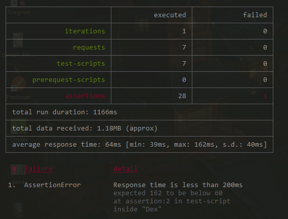
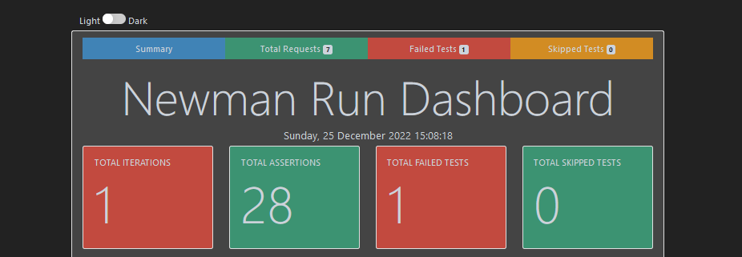
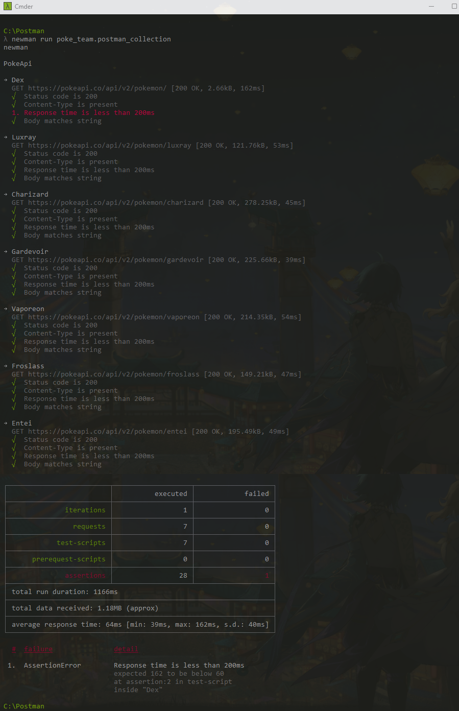

# Newman+htmlextra

O Newman é um runner de collections de API, sua base é em node e pode ser executado através de linha de comando. Pode ser integrado aos processos de CI de sua pipeline, e a sua feature é pareada ao client do Postman, o que faz possível a execução das collections mantendo o mesmo comportamento existente dentro da aplicação.

Já o `htmlextra`, um reporter do Newman, consiste em criar um resumo em estilo de painel (HTML) e disponibilizar as informações sobre o que fora executado dentro da collection selecionada, gerando evidência do que foi testado, como foi testado, e detalhando visualmente os resultados obtidos durante a execução.

O objetivo de trabalhar com ambos nesse PDI é poder mostrar de maneira visual os resultados de uma automação de API durante sua execução, e fomentar resultados mais assertivos para apresentação à um time de desenvolvimento.

A API utilizada para automação desse projeto foi a PokéAPI, e como o Newman roda em nodejs, também se faz necessário que o mesmo esteja instalado.

[PokéAPI](https://pokeapi.co/)

[Download | Node.js](https://nodejs.org/en/download/)

# Rodando sua Collection com Newman+htmlextra

Instale o Newman

```jsx
$ npm install -g newman
```

E então o execute dentro da pasta onde se encontra o arquivo

```jsx
$ newman run mycollection
```

Você deverá ter um resultado semelhante a esse:

  

Quanto ao relatório do htmlextra, deverá ser executado o seguinte comando:

```jsx
 $ newman run poke_team.postman_collection -r htmlextra
```

dessa forma, será criada uma nova pasta dentro do diretório da collection com o arquivo html dos resultados da execução dos testes, e você deverá ter um resultado semelhante à esse:

  

 Por fim, para conferir os resultados completos da minha execução de teste, você pode fazer o download do arquivo html e comparar com a execução realizada pelo newman conforme abaixo:

   
